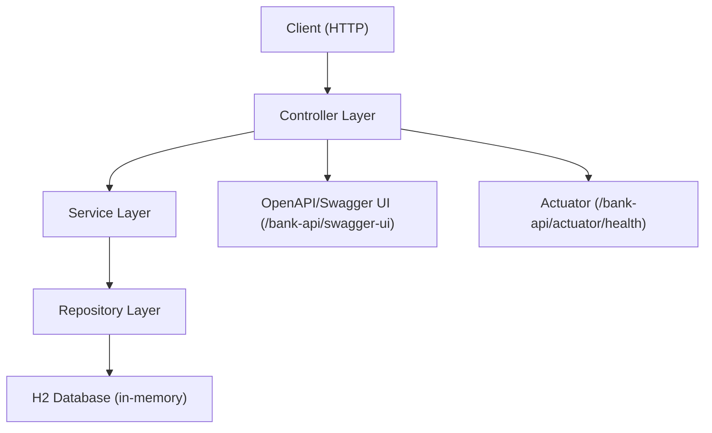

# BankApp-179898: Comprehensive Documentation

## Overview
BankApp-179898 is a Spring Boot 3 REST API that simulates basic banking operations, including customer and account management and transaction handling, backed by an in-memory H2 database. It exposes interactive OpenAPI documentation via Swagger UI, provides actuator health endpoints, and (currently) has all endpoints publicly accessible without authentication for ease of testing and debugging. The application runs by default on port 3001 with a servlet context path of /bank-api.

This document provides a complete reference to the features, endpoints, data models, architecture, security configuration, database configuration (H2), OpenAPI/Swagger, actuator/health endpoints, build and run instructions, versions, and the technology stack used.

## Features
The backend implements a conventional layered Spring architecture and provides:
- CRUD operations for customers (create, list, fetch by number, update, delete).
- Bank account management (list all, fetch by account number, create accounts for customers).
- Transactions support including transfer and transaction history by account.
- In-memory H2 database with web console enabled for local inspection.
- OpenAPI documentation via springdoc-openapi, with Swagger UI under /bank-api/swagger-ui.
- Actuator health endpoint for runtime diagnostics at /bank-api/actuator/health.
- Temporary global anonymous access: All endpoints are publicly accessible; HTTP Basic and CSRF are disabled; frame options disabled to allow the H2 console.

## API Endpoints
All endpoints are served under the base path /bank-api due to the configured context path.

### Health and Diagnostics
- GET /bank-api/healthz — Simple application health check returning {"status":"ok"}.
- GET /bank-api/actuator/health — Spring Boot Actuator health endpoint.

### Customers
- GET /bank-api/customers — List all customers.
- GET /bank-api/customers/all — Legacy list of all customers (backward compatibility).
- POST /bank-api/customers/add — Create a new customer.
  - Request body: CustomerDetails (JSON)
  - Response: ResponseEntity<Object> (typically status 201 Created on success)
- GET /bank-api/customers/{customerNumber} — Retrieve a customer by their customer number.
  - Path variable: customerNumber (Long)
  - Response: CustomerDetails (JSON)
- PUT /bank-api/customers/{customerNumber} — Update a customer by their customer number.
  - Path variable: customerNumber (Long)
  - Request body: CustomerDetails (JSON)
  - Response: ResponseEntity<Object> (200 or 404 if not found)
- DELETE /bank-api/customers/{customerNumber} — Delete a customer by their customer number.
  - Path variable: customerNumber (Long)
  - Response: ResponseEntity<Object>

### Accounts and Transactions
- GET /bank-api/accounts — List all accounts.
  - Response: List<AccountInformation> (JSON)
- GET /bank-api/accounts/{accountNumber} — Get account by account number.
  - Path variable: accountNumber (Long)
  - Response: ResponseEntity<Object>
- POST /bank-api/accounts/add/{customerNumber} — Create a new bank account for a customer.
  - Path variable: customerNumber (Long)
  - Request body: AccountInformation (JSON)
  - Response: ResponseEntity<Object>
- PUT /bank-api/accounts/transfer/{customerNumber} — Transfer funds between accounts for a customer.
  - Path variable: customerNumber (Long)
  - Request body: TransferDetails (JSON with fromAccountNumber, toAccountNumber, transferAmount)
  - Response: ResponseEntity<Object>
- GET /bank-api/accounts/transactions/{accountNumber} — Get transaction history by account number.
  - Path variable: accountNumber (Long)
  - Response: List<TransactionDetails> (JSON)

### OpenAPI/Swagger
- GET /bank-api/swagger-ui/index.html — Swagger UI (interactive API docs).
- GET /bank-api/swagger-ui — Redirect/forward to the Swagger UI index.
- GET /bank-api/v3/api-docs — OpenAPI JSON.

### H2 Database Console
- GET /bank-api/h2-console — H2 console (web UI).

## Data Models (Entities/DTOs)
The app uses a clear separation between JPA entities (under model) and domain DTOs used by controllers/services (under domain).

### JPA Entities (src/main/java/.../model)
- Customer
  - Fields: id (UUID), firstName, lastName, middleName, customerNumber (Long), status, customerAddress (ManyToOne Address), contactDetails (OneToOne Contact), createDateTime, updateDateTime.
- Account
  - Fields: id (UUID), accountNumber (Long), bankInformation (OneToOne BankInfo), accountStatus, accountType, accountBalance (Double), createDateTime, updateDateTime.
- Transaction
  - Fields: id (UUID), accountNumber (Long), txDateTime, txType, txAmount (Double).
- Address, Contact, BankInfo, CustomerAccountXRef (additional entity types used by relationships and cross-references).

### Domain DTOs (src/main/java/.../domain)
- CustomerDetails — Data carrier for customer-related operations.
- AccountInformation — Data carrier for account data.
- TransactionDetails — Data carrier representing transaction information.
- TransferDetails — Fields: fromAccountNumber (Long), toAccountNumber (Long), transferAmount (Double).
- AddressDetails, BankInformation, ContactDetails — Additional domain data structures.

These domain classes are converted to/from entity classes using a dedicated helper (BankingServiceHelper).

## Architecture & Code Structure
The code follows a conventional layered Spring Boot architecture:

- Entry point:
  - BankingApplication.java
- Controller layer (REST endpoints):
  - controller/
    - CustomerController.java
    - AccountController.java
    - HealthController.java
    - HomeController.java (simple redirect/forward to Swagger UI)
- Service layer:
  - service/
    - BankingService.java (interface)
    - BankingServiceImpl.java (implementation)
    - helper/BankingServiceHelper.java (DTO/entity conversions)
- Repository layer:
  - repository/
    - CustomerRepository, AccountRepository, TransactionRepository, CustomerAccountXRefRepository
  - These extend Spring Data CRUD repositories for persistence.
- Domain and Model:
  - domain/ — DTOs used in API request/response and service interfaces
  - model/ — JPA entities persisted in H2
- Configuration:
  - config/
    - SecurityConfig — Spring Security 6 configuration (currently permitAll).
    - OpenApiConfig — OpenAPI metadata and server base URL (/bank-api).
    - ApplicationConfig — documentation and reserved for future customizations.
    - DataInitializer — seeds initial sample data on startup if database is empty.
- Resources:
  - src/main/resources/
    - application.yml — base configuration (port 3001, context-path /bank-api, H2, springdoc).
    - application-dev.yml — optional dev profile overrides.
    - static/index.html — basic static resource.

### High-level architecture diagram


## Security (Spring Security setup)
SecurityConfig configures a SecurityFilterChain with:
- Global permitAll — All requests are allowed without authentication (temporary to simplify testing).
- CSRF disabled — Facilitates stateless API clients and testing.
- HTTP Basic disabled — Avoids browser login prompts.
- Form login disabled.
- Frame options disabled — Required for H2 console rendering.

Note: README reiterates that authentication is fully disabled temporarily. When re-enabling security later, common patterns include HTTP Basic with relaxed access for /v3/api-docs/**, /swagger-ui/**, and /h2-console/**.

## Database (H2 configuration & console)
H2 in-memory database is used for persistence during runtime. Key details:
- H2 console enabled and accessible at /bank-api/h2-console
- Default datasource is the Spring Boot managed in-memory database (jdbc:h2:mem:testdb).
- JPA:
  - spring.jpa.hibernate.ddl-auto: create-drop (in application.yml)
  - show-sql: true
  - defer-datasource-initialization: true (permits DataInitializer and SQL init sequencing)
- The application seeds initial data at startup via DataInitializer if repositories are empty.

If needed, you can specify an explicit datasource URL in application.yml (example):
```
spring:
  datasource:
    url: jdbc:h2:mem:testdb;DB_CLOSE_DELAY=-1;DB_CLOSE_ON_EXIT=FALSE
    driverClassName: org.h2.Driver
    username: sa
    password:
  jpa:
    hibernate:
      ddl-auto: update
```

## OpenAPI/Swagger
OpenAPI is provided by springdoc-openapi with configuration in OpenApiConfig and springdoc settings in application.yml.
- Swagger UI: http://localhost:3001/bank-api/swagger-ui/index.html
- OpenAPI JSON: http://localhost:3001/bank-api/v3/api-docs
- The server base URL in the OpenAPI definition is /bank-api.

A convenience redirect/forward is also available at /bank-api/swagger-ui.

## Actuator/Health
Actuator is included, exposing:
- GET /bank-api/actuator/health — Reports application health (JSON with status).
- GET /bank-api/healthz — Lightweight custom health endpoint returning {"status":"ok"}.

These endpoints are public under the current SecurityConfig (permitAll).

## Build & Run
Default runtime configuration:
- Port: 3001
- Context path: /bank-api

Build (preferred wrapper):
- ./mvnw -q -DskipTests clean package
- Or: ./mvn -q -DskipTests clean package (shim that proxies to wrapper)
- Makefile: make build
- If execute permission blocked: sh mvnw -q -DskipTests clean package

Run:
- ./mvnw spring-boot:run -Dspring-boot.run.arguments="--server.port=3001 --server.address=0.0.0.0"
- Or using shim: ./mvn spring-boot:run -Dspring-boot.run.arguments="--server.port=3001 --server.address=0.0.0.0"
- Makefile: make run
- Scripts: ./run.sh or ./start (supports CLEAN_PACKAGE=true) or ./start.sh

Quick verification (no auth required when security is open):
- curl -i http://localhost:3001/bank-api/healthz
- curl -i http://localhost:3001/bank-api/actuator/health
- curl -i http://localhost:3001/bank-api/v3/api-docs
- curl -i http://localhost:3001/bank-api/swagger-ui/index.html
- curl -i http://localhost:3001/bank-api/h2-console
- curl -i http://localhost:3001/bank-api/customers

## Versions & Tech Stack
Languages/Frameworks:
- Java: 17 (java.version=17; compiler release=17)
- Spring Boot: 3.2.10 (parent)
- Spring Security: 6.x (via Boot 3.2.10)
- Spring Data JPA: via Boot 3.2.10
- Spring Web (MVC): via Boot 3.2.10
- Spring Boot Actuator: via Boot 3.2.10
- Database: H2 (runtime)
- OpenAPI/Swagger: springdoc-openapi-starter-webmvc-ui 2.6.0
- Lombok: optional, for boilerplate reduction
- JAXB for Java 17+/21 compatibility:
  - jakarta.xml.bind-api: 4.0.2
  - org.glassfish.jaxb: jaxb-runtime: 4.0.5
- Build: Maven with Maven Wrapper; maven-compiler-plugin 3.13.0; maven-surefire-plugin 3.2.5

Notable configuration:
- server.port=3001
- server.servlet.context-path=/bank-api
- springdoc.swagger-ui.path=/swagger-ui (UI at /bank-api/swagger-ui/index.html)
- H2 console enabled at /bank-api/h2-console
- JPA ddl-auto=create-drop (base), show-sql=true

## Future Enhancements
- Re-enable authentication with Spring Security (e.g., HTTP Basic) while preserving relaxed access to Swagger and H2 console for development via explicit request matchers.
- Introduce role-based authorization for customer and account operations.
- Add endpoints for deposit and withdrawal operations as first-class REST endpoints if needed (currently transfer and transaction history are available; deposits/withdrawals may be represented via transaction semantics).
- Add persistence migration to a durable database (e.g., PostgreSQL or MySQL) for production.
- Add validation annotations and error handling responses for request payloads.
- Expand actuator exposure and metrics for improved observability.
- Harden CSRF and security headers when moving to production.
- Provide end-to-end tests and more integration tests around business flows.

## Quick Reference: URLs
- Base path: http://localhost:3001/bank-api
- Health: /healthz
- Actuator health: /actuator/health
- Swagger UI: /swagger-ui/index.html
- OpenAPI JSON: /v3/api-docs
- H2 Console: /h2-console

